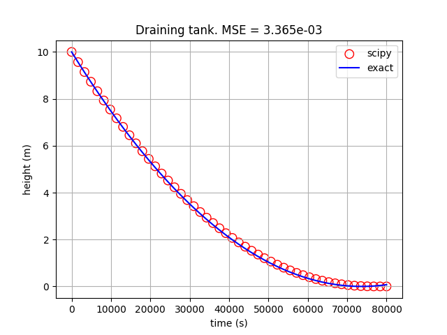

Gravity Drained Tank
~~~~~~~~~~~~~~~~~~~~~~

Importing packages
------------------------

.. literalinclude:: ../../../../examples/simulation/draining_tank/problem.py
  :language: python
  :lines: 12-16

The Model
-----------------

.. literalinclude:: ../../../../examples/simulation/draining_tank/problem.py
  :language: python
  :pyobject: generate_model

Complete Script
''''''''''''''''

The complete script is as follows,

.. literalinclude:: ../../../../examples/simulation/draining_tank/problem.py
  :language: python

